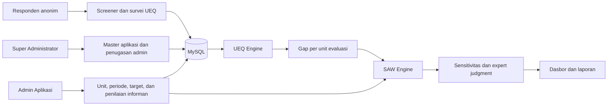
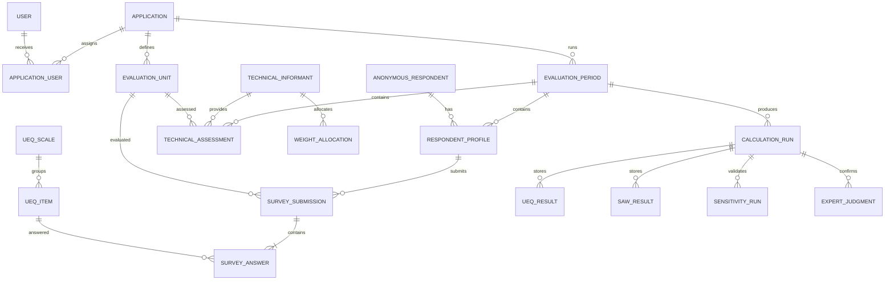

# SPESIFIKASI DESAIN APLIKASI WEB UEQ-SAW

**Platform Survei UEQ-SAW Reusable untuk Aplikasi di Kabupaten Indramayu**  
**Studi kasus utama:** Sistem Pendukung Keputusan Prioritas Perbaikan Modul Wong Reang Apps  
**Platform:** Laravel 13, Livewire 4, Tailwind CSS 4, MySQL 8  
**Disusun untuk:** Bakhrul Ullum (250101020011)  
**Sumber kebutuhan:** Bab I sampai Bab III Laporan Tugas Akhir  
**Status:** Baseline desain revisi untuk ditinjau sebelum implementasi  
**Tanggal:** 4 Agustus 2026

## 1. Ringkasan Eksekutif

Dokumen ini menetapkan spesifikasi platform web untuk mengumpulkan evaluasi User Experience Questionnaire (UEQ), mengelola penilaian teknis hasil wawancara, menghitung prioritas perbaikan menggunakan Simple Additive Weighting (SAW), menjalankan analisis sensitivitas, dan menyajikan rekomendasi. Platform dapat dikonfigurasi untuk berbagai aplikasi yang penggunanya berdomisili di Kabupaten Indramayu, sedangkan Wong Reang Apps tetap menjadi objek pengumpulan data, implementasi metode, dan pembahasan hasil penelitian utama.

Aplikasi dirancang sebagai modular monolith Laravel dengan satu database dan isolasi data berbasis aplikasi. Super Administrator membuat aplikasi serta mengundang Admin Aplikasi; registrasi administrator publik tidak tersedia. Admin Aplikasi hanya dapat mengakses aplikasi yang ditugaskan kepadanya. Responden tidak membuat akun. Identitas anonim dikenali melalui cookie perangkat yang disimpan sebagai token acak dan di-hash pada basis data. Seorang responden boleh menilai beberapa unit evaluasi, tetapi hanya satu kali untuk unit yang sama dalam satu periode. Penilaian teknis dari tiga sampai lima informan dimasukkan oleh Admin Aplikasi per informan menggunakan kode anonim agar rata-rata, deviasi standar, dan jejak audit tetap dapat diverifikasi.

Sistem mendukung banyak aplikasi dan periode evaluasi. Setiap aplikasi hanya boleh mempunyai satu periode aktif, tetapi periode pada aplikasi berbeda dapat berjalan bersamaan. Untuk Wong Reang Apps, target dikunci pada minimal 96 responden anonim unik secara keseluruhan, minimal 20 evaluasi valid per modul, dan target ideal 30 evaluasi valid per modul. Aplikasi lain dapat memakai target berbeda yang ditetapkan Admin Aplikasi dengan alasan wajib. Angka target merupakan parameter operasional dan metodologis, bukan jaminan bahwa sampel otomatis representatif.

> **Keputusan utama:** sistem harus mengutamakan keterlacakan perhitungan. Setiap hasil UEQ, gap, SAW, sensitivitas, dan pemeringkatan harus dapat ditelusuri ke data masukan serta versi kalkulasi yang menghasilkannya.

## 2. Masalah, Asumsi, dan Koreksi Kritis

### 2.1 Masalah yang Diselesaikan

1. Belum tersedia mekanisme terstruktur untuk mengumpulkan evaluasi UX per modul Wong Reang Apps.
2. Hasil UEQ deskriptif belum langsung menghasilkan urutan prioritas perbaikan.
3. Penetapan prioritas berisiko subjektif ketika keterbatasan waktu dan urgensi arsitektur tidak dihitung bersama persepsi pengguna.
4. Proses pemindahan data manual berisiko menimbulkan kesalahan dan sulit diaudit.
5. Manajemen memerlukan dasbor yang menampilkan profil UX, gap, matriks keputusan, sensitivitas, dan backlog prioritas.

### 2.2 Asumsi Desain

- Objek penelitian utama adalah 13 modul pada Wong Reang Apps versi Android; aplikasi lain hanya merupakan konfigurasi reusable dan tidak menjadi sumber kesimpulan penelitian ini.
- Responden berusia minimal 17 tahun, berdomisili di Kabupaten Indramayu, dan pernah menyelesaikan sedikitnya satu siklus layanan pada modul yang dinilai.
- Aplikasi Wong Reang tidak mengalami perubahan besar selama satu periode pengumpulan data.
- Informan teknis memahami modul yang dinilai dan memberikan estimasi berdasarkan kondisi riil.
- Nilai benchmark dan pemetaan polaritas UEQ telah diverifikasi sebelum periode diaktifkan.

### 2.3 Koreksi yang Wajib Diakui

- Cookie tidak membuktikan identitas manusia secara absolut. Penghapusan cookie, mode privat, atau pergantian perangkat masih memungkinkan respons ganda.
- Responden yang menilai beberapa modul menghasilkan repeated measures. Jumlah responden unik dan jumlah evaluasi modul wajib dilaporkan secara terpisah.
- Target yang disepakati berbeda dari narasi awal laporan yang menyebut 96 responden secara umum. Bab II dan Bab III perlu diselaraskan menjadi 96 responden unik keseluruhan, minimal 20 evaluasi valid per modul, dan target 30 per modul.
- Rumus transformasi UEQ bergantung pada arah polaritas item. Rumus `jawaban - 4` tidak boleh digunakan untuk seluruh item tanpa kunci polaritas.
- Nilai batas kategori benchmark lengkap per skala belum seluruhnya dinyatakan dalam laporan. Sistem tidak boleh mengarang batas tersebut; Super Administrator harus memasukkan versi benchmark terverifikasi.
- Kriteria SAW yang diimplementasikan hanya tiga: gap UEQ, estimasi waktu, dan urgensi arsitektur. Penyebutan biaya atau arah kebijakan pada bagian latar belakang tidak ditambahkan sebagai kriteria tanpa revisi metodologi.
- Kemampuan reusable divalidasi secara fungsional. Validasi empiris UEQ-SAW dan pembahasan hasil tetap hanya untuk Wong Reang Apps.

## 3. Tujuan dan Indikator Keberhasilan

### 3.1 Tujuan Produk

- Mengumpulkan jawaban UEQ per unit evaluasi dengan pencegahan duplikasi berbasis cookie.
- Mengotomatisasi transformasi skor UEQ sesuai polaritas dan pengelompokan enam skala.
- Menggabungkan gap UEQ dengan penilaian teknis menggunakan SAW.
- Mempertahankan data mentah, hasil antara, dan hasil akhir untuk audit.
- Menyajikan keputusan dalam bentuk yang dapat dipahami manajemen.
- Mendukung periode evaluasi berikutnya dan konfigurasi aplikasi lain di Kabupaten Indramayu tanpa membangun platform baru.

### 3.2 Indikator Keberhasilan MVP

| ID | Indikator | Target penerimaan |
|---|---|---|
| IK-01 | Kelengkapan jawaban UEQ | 26 dari 26 item sebelum submit |
| IK-02 | Pencegahan duplikasi utama | Satu cookie hanya satu submission per unit dan periode |
| IK-03 | Responden unik Wong Reang | Minimal 96 pada periode penelitian |
| IK-04 | Sampel unit Wong Reang | Minimal 20; target ideal 30 |
| IK-05 | Akurasi transformasi | Sesuai kunci polaritas untuk seluruh 26 item |
| IK-06 | Akurasi SAW | Sama dengan perhitungan pembanding untuk fixture uji |
| IK-07 | Auditabilitas | Setiap perubahan administratif dan run kalkulasi terlacak |
| IK-08 | Responsivitas UI | Survei dapat digunakan pada layar ponsel 360 px ke atas |
| IK-09 | Keamanan admin | Autentikasi, 2FA, CSRF, rate limit, dan otorisasi aktif |
| IK-10 | Ekspor hasil | CSV/XLSX untuk data dan PDF untuk ringkasan tersedia |

## 4. Ruang Lingkup

### 4.1 Termasuk dalam MVP

- Manajemen periode evaluasi.
- Master aplikasi, penugasan Admin Aplikasi, unit evaluasi, 26 item UEQ, enam skala, polaritas, dan benchmark.
- Screener serta persetujuan responden anonim.
- Survei UEQ per unit evaluasi.
- Pemantauan sampel dan pemeriksaan kualitas respons.
- Input penilaian teknis dan alokasi bobot per informan oleh Admin Aplikasi.
- Kalkulasi mean, reliabilitas, benchmark, gap, normalisasi, bobot, nilai Vi, dan peringkat.
- Analisis sensitivitas tiga skenario.
- Pencatatan expert judgment.
- Dasbor, rekomendasi backlog, ekspor, audit log, dan penguncian data.

### 4.2 Tidak Termasuk dalam MVP

- Perubahan kode atau integrasi langsung ke Wong Reang Apps.
- Akun responden atau penyimpanan NIK.
- SaaS multi-tenant, registrasi organisasi mandiri, langganan, atau domain khusus tiap aplikasi.
- Aplikasi mobile native.
- Otomatisasi keputusan perbaikan tanpa konfirmasi manusia.
- Pencegahan duplikasi berbasis fingerprint invasif.
- Kriteria SAW di luar tiga kriteria yang disetujui.
- Perubahan bobot skala UEQ berdasarkan importance rating.

## 5. Aktor dan Otorisasi

### 5.1 Responden Anonim

Responden mengakses tautan periode aktif, menyetujui informasi penelitian, lolos screener, memilih unit evaluasi yang pernah digunakan, mengisi 26 item, dan mengirim jawaban. Responden dapat kembali untuk menilai unit lain menggunakan perangkat yang sama.

### 5.2 Super Administrator/Peneliti

Super Administrator membuat aplikasi, mengundang dan menonaktifkan Admin Aplikasi, mengelola instrumen UEQ serta benchmark global, melihat audit lintas aplikasi, dan mengawasi sistem. Registrasi publik harus dinonaktifkan. Akun awal dibuat melalui seed yang aman.

### 5.3 Admin Aplikasi

Admin Aplikasi hanya mengelola aplikasi yang ditugaskan kepadanya: unit evaluasi, periode, screener, target, respons, informan, penilaian teknis, kalkulasi, validasi, dasbor, dan ekspor. Seluruh operasi wajib melalui policy dan scope aplikasi; pembatasan tidak boleh hanya dilakukan dengan menyembunyikan menu.

### 5.4 Matriks Hak Akses

| Kapabilitas | Responden anonim | Admin Aplikasi | Super Administrator |
|---|---:|---:|---:|
| Melihat periode aktif | Ya | Aplikasi sendiri | Semua aplikasi |
| Mengisi screener dan survei | Ya | Tidak sebagai admin | Tidak sebagai admin |
| Melihat jawaban individual | Tidak | Aplikasi sendiri | Semua aplikasi |
| Mengelola aplikasi dan akun admin | Tidak | Tidak | Ya |
| Mengelola periode dan unit | Tidak | Aplikasi sendiri | Semua aplikasi |
| Memasukkan data informan | Tidak | Aplikasi sendiri | Semua aplikasi |
| Menjalankan kalkulasi | Tidak | Aplikasi sendiri | Semua aplikasi |
| Mengunci hasil | Tidak | Aplikasi sendiri | Semua aplikasi |
| Mengekspor data | Tidak | Aplikasi sendiri | Semua aplikasi |
| Melihat audit log | Tidak | Aplikasi sendiri | Semua aplikasi |

## 6. Arsitektur Sistem

### 6.1 Pilihan Arsitektur

Arsitektur menggunakan modular monolith. UI, autentikasi, layanan aplikasi, mesin perhitungan, dan akses data berada dalam satu repository serta satu deployment, tetapi dipisahkan menurut domain agar logika UEQ-SAW tidak bercampur dengan komponen tampilan.

### 6.2 Stack Teknis

| Lapisan | Teknologi | Keputusan |
|---|---|---|
| Backend | Laravel 13 / PHP 8.3+ | Framework utama |
| UI reaktif | Livewire 4 + Blade | Menghindari kompleksitas SPA terpisah |
| Styling | Tailwind CSS 4 | Responsif dan konsisten |
| Komponen UI | Flux UI atau komponen Blade internal | Gunakan hanya komponen yang dibutuhkan |
| Grafik | Chart.js 4.x | Radar, bar, line, dan perbandingan peringkat |
| Database | MySQL 8 | Satu sumber data transaksional |
| Cache/queue MVP | Driver database | Tidak mewajibkan Redis |
| Ekspor | Laravel Excel dan PDF renderer yang dipilih saat implementasi | Ekspor data dan ringkasan |
| Pengujian | Pest/PHPUnit + Laravel Dusk bila diperlukan | Unit, feature, dan browser test |

### 6.3 Modul Aplikasi

1. **Identity & Access:** login, 2FA, sesi, kebijakan akses.
2. **Application Registry:** master aplikasi, penugasan admin, dan unit evaluasi.
3. **Evaluation Period:** siklus hidup periode, screener, dan target sampel.
4. **Survey:** cookie anonim, pemilihan unit, UEQ, dan submit.
5. **Response Quality:** flag, inklusi, eksklusi, dan alasan keputusan.
6. **Technical Assessment:** informan, estimasi hari, urgensi, dan bobot.
7. **UEQ Engine:** transformasi, agregasi skala, reliabilitas, benchmark, dan gap.
8. **SAW Engine:** matriks, normalisasi, pembobotan, Vi, peringkat, dan kategori.
9. **Validation:** sensitivitas, iterasi bobot, dan expert judgment.
10. **Reporting:** dasbor, tabel rekomendasi, ekspor, serta snapshot hasil.
11. **Audit:** log perubahan, penguncian, dan pelacakan versi.

### 6.4 Alur Data Tingkat Tinggi



### 6.5 Topologi Deployment MVP

- Satu aplikasi web pada server Linux dengan HTTPS.
- Satu database MySQL yang tidak diekspos ke internet.
- Penyimpanan lokal privat atau object storage untuk ekspor.
- Scheduler untuk pembersihan token sementara dan pekerjaan berkala.
- Database queue worker untuk ekspor atau kalkulasi berat.
- Backup database harian selama periode aktif.

## 7. Kebutuhan Fungsional

### 7.1 Periode Evaluasi

| ID | Kebutuhan |
|---|---|
| FR-PER-01 | Admin Aplikasi dapat membuat periode dengan nama, slug, tanggal buka/tutup, target responden unik, minimum per unit, target per unit, usia minimum, dan dasar target. |
| FR-PER-02 | Setiap aplikasi hanya dapat memiliki satu periode aktif; aplikasi berbeda dapat aktif bersamaan. |
| FR-PER-03 | Status periode: draft, active, closed, calculated, validated, locked, archived. |
| FR-PER-04 | Periode hanya dapat diaktifkan jika aplikasi, penugasan admin, unit evaluasi, item, polaritas, benchmark, screener, dan target lolos validasi. |
| FR-PER-05 | Penutupan periode menghentikan submission baru tanpa menghapus data. |
| FR-PER-06 | Penguncian periode mencegah perubahan data input dan hasil. |

### 7.2 Aplikasi, Unit, dan Penugasan Admin

| ID | Kebutuhan |
|---|---|
| FR-APP-01 | Super Administrator membuat, mengaktifkan, dan mengarsipkan master aplikasi. |
| FR-APP-02 | Super Administrator mengundang atau menonaktifkan Admin Aplikasi tanpa registrasi publik. |
| FR-APP-03 | Satu aplikasi dapat memiliki beberapa Admin Aplikasi dan satu admin dapat ditugaskan ke beberapa aplikasi. |
| FR-APP-04 | Admin Aplikasi hanya dapat membaca atau mengubah data aplikasi yang ditugaskan. |
| FR-APP-05 | Admin Aplikasi membuat unit evaluasi berupa modul, fitur, layanan, atau proses. |
| FR-APP-06 | Wong Reang Apps memakai 13 modul awal dan target penelitiannya dikunci oleh konfigurasi sistem. |
| FR-APP-07 | Perubahan penugasan admin, status aplikasi, dan data unit menghasilkan audit log. |

### 7.3 Cookie, Screener, dan Profil Minimum

| ID | Kebutuhan |
|---|---|
| FR-RES-01 | Sistem membuat token acak pada kunjungan pertama dan menyimpannya sebagai cookie terenkripsi. |
| FR-RES-02 | Basis data hanya menyimpan hash token, bukan nilai cookie mentah. |
| FR-RES-03 | Responden wajib menyetujui informasi penelitian dan penggunaan cookie. |
| FR-RES-04 | Screener selalu memeriksa persetujuan, domisili Kabupaten Indramayu, penggunaan aplikasi, dan penggunaan unit yang dinilai. |
| FR-RES-05 | Responden yang tidak memenuhi syarat diarahkan ke halaman penolakan tanpa membuat submission. |
| FR-RES-06 | Usia minimum dapat diatur per periode dengan nilai awal 17 tahun dan dikunci setelah aktivasi. |
| FR-RES-07 | Admin Aplikasi dapat menambahkan maksimal dua pertanyaan Ya/Tidak dengan nilai kelulusan eksplisit. |
| FR-RES-08 | Sistem menampilkan unit yang sudah dan belum dinilai oleh cookie tersebut. |
| FR-RES-09 | Cookie yang sama tidak dapat membuat submission kedua untuk unit dan periode yang sama. |

### 7.4 Survei UEQ

| ID | Kebutuhan |
|---|---|
| FR-SUR-01 | Responden memilih satu unit evaluasi aktif yang benar-benar pernah digunakan. |
| FR-SUR-02 | Sistem menampilkan petunjuk pengisian dan 26 pasangan kata UEQ Bahasa Indonesia. |
| FR-SUR-03 | Setiap item menggunakan pilihan 1 sampai 7 dan menampilkan kedua label kutub. |
| FR-SUR-04 | Navigasi dapat berupa satu halaman atau langkah pendek tanpa mengubah urutan item standar. |
| FR-SUR-05 | Submit ditolak jika ada item kosong. |
| FR-SUR-06 | Sistem menyimpan skor mentah, waktu mulai, waktu selesai, urutan item, versi instrumen, aplikasi, dan unit evaluasi. |
| FR-SUR-07 | Setelah submit, sistem menampilkan terima kasih dan pilihan menilai unit lain. |
| FR-SUR-08 | Sistem tidak menampilkan skor terkonversi atau hasil analisis kepada responden. |

### 7.5 Kualitas Respons

| ID | Kebutuhan |
|---|---|
| FR-QUA-01 | Sistem memberi flag pada respons yang lebih cepat dari ambang konfigurasi. |
| FR-QUA-02 | Sistem memberi flag pada jawaban mentah yang seluruhnya identik atau pola lain yang dikonfigurasi. |
| FR-QUA-03 | Flag tidak otomatis mengecualikan respons. |
| FR-QUA-04 | Admin Aplikasi dapat menetapkan included atau excluded dengan alasan wajib untuk respons aplikasinya. |
| FR-QUA-05 | Perubahan status inklusi menghasilkan audit log dan membuat kalkulasi lama berstatus stale. |
| FR-QUA-06 | Dasbor membedakan total submission, valid, flagged, dan excluded. |

### 7.6 Input Informan Teknis

| ID | Kebutuhan |
|---|---|
| FR-INF-01 | Admin Aplikasi membuat kode anonim informan tanpa menyimpan nama pada dataset analisis. |
| FR-INF-02 | Setiap informan memiliki penilaian untuk seluruh unit evaluasi: estimasi hari dan urgensi 1 sampai 5. |
| FR-INF-03 | Setiap informan mengalokasikan tepat 100 poin ke C1, C2, dan C3. |
| FR-INF-04 | Admin Aplikasi dapat menyimpan draft dan melakukan verifikasi sebelum mengunci data. |
| FR-INF-05 | Sistem menghitung mean dan deviasi standar per variabel serta unit evaluasi. |
| FR-INF-06 | Deviasi standar di atas 1 hari atau 1 poin menghasilkan status perlu konsensus. |
| FR-INF-07 | Admin Aplikasi mencatat tanggal, ringkasan diskusi, nilai hasil konsensus, dan sumber catatan wawancara. |
| FR-INF-08 | Kalkulasi final diblokir jika ada penilaian wajib yang kosong atau belum diselesaikan. |

### 7.7 Kalkulasi UEQ dan SAW

| ID | Kebutuhan |
|---|---|
| FR-CAL-01 | Admin Aplikasi dapat menjalankan preview kalkulasi aplikasinya tanpa mengunci hasil. |
| FR-CAL-02 | Sistem memvalidasi kecukupan sampel dan menampilkan peringatan per unit sesuai target periode. |
| FR-CAL-03 | Sistem mengubah skor berdasarkan polaritas item dan menyimpan hasil antara. |
| FR-CAL-04 | Sistem menghitung mean enam skala per unit evaluasi. |
| FR-CAL-05 | Sistem menghitung Cronbach's Alpha global per skala; hasil per unit bersifat tambahan bila memadai. |
| FR-CAL-06 | Sistem menghitung gap per skala dan Gapm per unit evaluasi. |
| FR-CAL-07 | Sistem membentuk matriks X dan R, bobot, kontribusi per kriteria, Vi, dan peringkat. |
| FR-CAL-08 | Setiap kalkulasi membuat calculation run baru dan tidak menimpa run lama. |
| FR-CAL-09 | Input yang berubah menandai run sebelumnya stale tetapi tetap dapat dibuka. |
| FR-CAL-10 | Admin Aplikasi dapat mengunci satu run sebagai hasil resmi periode aplikasinya. |
| FR-CAL-11 | UEQ dapat dihitung untuk satu unit, tetapi kalkulasi SAW diblokir jika alternatif lengkap kurang dari dua. |

### 7.8 Sensitivitas, Expert Judgment, dan Rekomendasi

| ID | Kebutuhan |
|---|---|
| FR-VAL-01 | Sistem menjalankan skenario A, B, dan C sesuai bobot yang ditetapkan. |
| FR-VAL-02 | Sistem membandingkan posisi tiga unit teratas antar-skenario; jika alternatif hanya dua, sistem membandingkan seluruh posisi. |
| FR-VAL-03 | Sistem menyatakan stabil hanya jika tiga posisi teratas tidak berubah. |
| FR-VAL-04 | Admin Aplikasi dapat mencatat maksimal dua iterasi peninjauan bobot. |
| FR-VAL-05 | Ketidakstabilan setelah dua iterasi harus dibawa ke expert judgment dengan catatan. |
| FR-VAL-06 | Expert judgment mencatat setuju/tidak, alasan, koreksi, dan urutan final jika terjadi seri. |
| FR-VAL-07 | Rekomendasi final tidak dapat dikunci sebelum tahap validasi selesai. |

### 7.9 Dasbor, Ekspor, dan Audit

| ID | Kebutuhan |
|---|---|
| FR-DAS-01 | Dasbor menampilkan jumlah responden unik dan jumlah evaluasi secara terpisah. |
| FR-DAS-02 | Dasbor menampilkan progres minimum/target untuk seluruh unit aplikasi terpilih. |
| FR-DAS-03 | Dasbor menyediakan radar chart enam skala untuk unit terpilih. |
| FR-DAS-04 | Dasbor menyediakan grafik mean terhadap benchmark dan gap per unit. |
| FR-DAS-05 | Dasbor menyediakan matriks X, matriks R, kontribusi bobot, Vi, dan peringkat. |
| FR-DAS-06 | Dasbor menyediakan perbandingan peringkat skenario sensitivitas. |
| FR-DAS-07 | Sistem mengekspor data mentah yang diizinkan, hasil agregat, matriks, dan rekomendasi. |
| FR-DAS-08 | Audit log dapat difilter menurut pengguna, objek, aksi, dan tanggal. |
| FR-DAS-09 | Ekspor mencantumkan periode, versi instrumen, versi benchmark, run ID, dan waktu pembuatan. |
| FR-DAS-10 | Admin Aplikasi tidak dapat melihat atau mengekspor respons, informan, run, laporan, maupun audit aplikasi lain. |

## 8. Aturan Bisnis

| ID | Aturan |
|---|---|
| BR-01 | Setiap aplikasi hanya boleh memiliki satu periode aktif; aplikasi berbeda dapat aktif bersamaan. |
| BR-02 | Satu hash cookie hanya satu submission untuk kombinasi periode dan unit evaluasi. |
| BR-03 | Satu submission valid harus memiliki tepat 26 jawaban unik. |
| BR-04 | Nilai mentah hanya 1 sampai 7. |
| BR-05 | Responden unik dihitung berdasarkan hash cookie dalam periode. |
| BR-06 | Kecukupan data unit dinilai terhadap minimum yang dikunci pada periode. |
| BR-07 | Target unit tercapai sesuai nilai target yang dikunci pada periode. |
| BR-08 | Khusus Wong Reang, target periode tercapai jika responden unik minimal 96 dan setiap modul minimal 20; target ideal per modul 30. |
| BR-09 | Cookie merupakan kontrol pencegahan, bukan bukti identitas. |
| BR-10 | Estimasi hari harus lebih besar dari nol. |
| BR-11 | Urgensi hanya 1 sampai 5. |
| BR-12 | Alokasi bobot setiap informan tepat 100 poin. |
| BR-13 | Bobot final adalah rata-rata alokasi informan yang dinormalisasi hingga jumlahnya 1. |
| BR-14 | Gap tidak pernah negatif. |
| BR-15 | Run final membutuhkan seluruh nilai teknis dan benchmark. |
| BR-16 | Nilai seri tidak dipecah secara tersembunyi; penyelesaian dicatat pada expert judgment. |
| BR-17 | Data terkunci tidak dapat diedit; koreksi dilakukan melalui versi baru. |
| BR-18 | Eksklusi respons wajib memiliki alasan dan audit log. |
| BR-19 | Domisili Kabupaten Indramayu merupakan syarat tetap seluruh survei. |
| BR-20 | Usia minimum dan maksimal dua pertanyaan tambahan dapat diatur saat draft, lalu dikunci ketika periode aktif. |
| BR-21 | Admin Aplikasi menetapkan target aplikasi non-Wong Reang beserta alasan tanpa persetujuan Super Administrator. |
| BR-22 | SAW membutuhkan minimal dua unit evaluasi dengan data UEQ dan penilaian teknis lengkap. |
| BR-23 | Semua akses Admin Aplikasi harus lolos pemeriksaan penugasan aplikasi. |

## 9. Model Data Konseptual

### 9.1 Hubungan Entitas



### 9.2 Tabel Inti

| Tabel | Kolom penting | Kendala utama |
|---|---|---|
| users | id, name, email, password, 2FA fields, active | email unik; registrasi publik nonaktif |
| applications | id, code, name, description, research_case, active | code dan name unik |
| application_user | application_id, user_id, role, assigned_at, active | unik application-user; hanya super admin menugaskan |
| evaluation_units | id, application_id, type, code, name, active, sort_order | code dan name unik per aplikasi |
| evaluation_periods | id, application_id, name, slug, dates, targets, target_basis, min_age, status, locked_at | maksimal satu active per aplikasi; slug unik |
| screener_questions | id, period_id, text, required_answer, sort_order, active | maksimal dua pertanyaan tambahan per periode |
| ueq_scales | id, code, name, dimension | enam skala baku |
| ueq_items | id, version, order, left_label, right_label, scale_id, polarity | order unik per versi |
| ueq_benchmark_versions | id, name, source, effective_date, locked | versi tidak boleh berubah setelah dipakai |
| ueq_benchmarks | version_id, scale_id, good_threshold, category thresholds | unik per versi dan skala |
| anonymous_respondents | id, token_hash, first_seen_at, last_seen_at | token_hash unik |
| respondent_profiles | id, period_id, respondent_id, consent, eligibility fields | unik per period dan respondent |
| survey_submissions | id, period_id, profile_id, unit_id, status, timestamps, duration | unik period-profile-unit |
| survey_answers | submission_id, item_id, raw_value, converted_value | unik submission-item; raw 1-7 |
| response_flags | submission_id, rule_code, severity, details, resolved_at | tidak menghapus submission |
| technical_informants | id, period_id, code, active | code unik per periode |
| technical_assessments | period_id, informant_id, unit_id, days, urgency, status | unik informant-unit-period |
| weight_allocations | period_id, informant_id, c1_points, c2_points, c3_points | total tepat 100 |
| consensus_records | period_id, unit_id, criterion, before, final, notes | wajib saat deviasi melampaui ambang |
| calculation_runs | id, period_id, number, input_hash, status, official_at | number unik per periode |
| ueq_results | run_id, unit_id, scale_id, n, mean, sd, alpha, benchmark, gap | unik run-unit-scale |
| saw_matrices | run_id, unit_id, c1, c2, c3, r1, r2, r3 | satu baris per unit |
| saw_results | run_id, unit_id, contribution fields, vi, rank, percentile, category | satu baris per unit |
| sensitivity_runs | run_id, scenario, weights, stability_status | skenario unik per run |
| sensitivity_results | sensitivity_run_id, unit_id, vi, rank | satu baris per unit dan skenario |
| expert_judgments | run_id, unit_id, decision, notes, final_order | audit keputusan manusia |
| audit_logs | application_id, user_id, event, auditable_type/id, old_values, new_values, timestamp | append-only; dapat difilter per aplikasi |

### 9.3 Indeks dan Integritas

- Unique index pada `application_user(application_id, user_id)`.
- Unique index parsial/logika transaksi untuk satu `evaluation_periods` aktif per aplikasi.
- Unique index pada `survey_submissions(period_id, profile_id, unit_id)`.
- Unique index pada `survey_answers(submission_id, item_id)`.
- Foreign key dengan restrict delete untuk data yang sudah dipakai run.
- Soft delete hanya untuk master yang belum digunakan; data penelitian tidak dihapus diam-diam.
- Check constraint atau validasi aplikasi untuk nilai 1–7, urgensi 1–5, hari > 0, dan jumlah bobot 100.
- `input_hash` dibentuk dari ID dan timestamp/version input agar perubahan dapat dideteksi.
- Foreign key dan policy memastikan unit, periode, informan, respons, run, dan ekspor berasal dari aplikasi yang sama.

## 10. Spesifikasi Algoritma

### 10.1 Transformasi Item UEQ

Untuk jawaban mentah `x` pada skala 1 sampai 7:

```text
jika kutub kanan positif: y = x - 4
jika kutub kiri positif : y = 4 - x
```

Hasil `y` harus berada pada rentang -3 sampai +3. Polaritas disimpan pada master item, tidak ditentukan dari teks label saat runtime.

### 10.2 Mean Skala per Unit Evaluasi

```text
Mean(u,k) = jumlah seluruh skor terkonversi item skala k pada unit u
            / jumlah seluruh skor valid yang berkontribusi
```

Sistem juga menyimpan `n`, simpangan baku, standard error, dan confidence interval agar perbedaan ukuran sampel terlihat.

### 10.3 Reliabilitas

Cronbach's Alpha dihitung per skala menggunakan jawaban valid. Hasil utama dihitung secara global pada periode sesuai rancangan laporan. Hasil per unit ditampilkan sebagai analisis tambahan jika jumlah evaluasi dan variasi data memungkinkan. Nilai di bawah 0,70 menghasilkan peringatan dan tidak boleh disembunyikan.

### 10.4 Benchmark dan Gap

Nilai acuan awal yang dinyatakan dalam Bab III:

| Skala | Bk, batas bawah Good |
|---|---:|
| Attractiveness | 1,58 |
| Perspicuity | 1,73 |
| Efficiency | 1,50 |
| Dependability | 1,48 |
| Stimulation | 1,35 |
| Novelty | 1,12 |

```text
Gap(u,k) = max(0, Bk - Mean(u,k))
Gap(u)   = jumlah enam Gap(u,k) / 6
```

Jika full category thresholds belum tersedia, sistem hanya menampilkan posisi terhadap `Bk` dan tidak mengarang kategori Excellent sampai Bad.

### 10.5 Matriks Keputusan SAW

| Kriteria | Nilai | Sifat |
|---|---|---|
| C1 | Gap(u) | Benefit |
| C2 | Rata-rata estimasi waktu dalam hari | Cost |
| C3 | Rata-rata urgensi arsitektur 1–5 | Benefit |

Normalisasi:

```text
Benefit: r(i,j) = x(i,j) / max_i x(i,j)
Cost   : r(i,j) = min_i x(i,j) / x(i,j)
```

Kasus tepi:

- Jika seluruh C1 bernilai nol, seluruh R1 ditetapkan nol dan run diberi peringatan tidak ada defisit UX terhadap acuan.
- C2 tidak boleh nol atau negatif.
- Jika nilai benefit maksimum nol, kolom normalisasi ditetapkan nol dan peringatan dicatat.
- Nilai tidak boleh diimputasi otomatis ketika data hilang.

### 10.6 Bobot dan Nilai Preferensi

Setiap informan membagi 100 poin ke C1, C2, dan C3. Sistem merata-ratakan poin seluruh informan lalu menormalisasi hasil agar jumlah bobot tepat 1 setelah pembulatan.

```text
Vi = (w1 * r(i,1)) + (w2 * r(i,2)) + (w3 * r(i,3))
```

Nilai disimpan dengan presisi tinggi; UI boleh menampilkan empat angka desimal. Pengurutan menggunakan nilai presisi penuh.

### 10.7 Peringkat dan Kategori

Unit evaluasi diurutkan berdasarkan `Vi` menurun. Untuk `n` unit dengan `n >= 2`, percentile score dihitung secara eksplisit dari peringkat menurun. Pada studi Wong Reang, `n = 13`.

```text
percentile = (n - rank_desc) / (n - 1)
```

| Percentile | Kategori |
|---|---|
| >= 0,90 | Prioritas Utama |
| >= 0,75 dan < 0,90 | Prioritas Tinggi |
| >= 0,40 dan < 0,75 | Prioritas Menengah |
| >= 0,15 dan < 0,40 | Prioritas Rendah |
| < 0,15 | Prioritas Sangat Rendah |

Nilai `Vi` yang sama dalam toleransi presisi ditampilkan sebagai seri. Keputusan urutan backlog akhir dilakukan melalui expert judgment dan dicatat.

### 10.8 Analisis Sensitivitas

| Skenario | C1 Gap | C2 Waktu | C3 Urgensi | Perspektif |
|---|---:|---:|---:|---|
| A | 0,33 | 0,33 | 0,34 | Baseline setara |
| B | 0,60 | 0,20 | 0,20 | Dominasi pengguna |
| C | 0,20 | 0,40 | 0,40 | Dominasi pengembang |

Model dengan minimal tiga alternatif stabil hanya jika posisi peringkat 1, 2, dan 3 identik pada seluruh skenario. Jika alternatif hanya dua, seluruh posisi harus identik. Jika berubah, Admin Aplikasi meninjau bobot bersama tim teknis dan dapat melakukan maksimal dua iterasi. Ketidakstabilan yang tersisa dibawa ke expert judgment dan dicantumkan pada laporan.

## 11. Rancangan Antarmuka

### 11.1 Prinsip UX

- Mobile-first untuk responden; desktop-first tetapi responsif untuk administrator.
- Bahasa Indonesia yang ringkas dan tidak teknis pada area publik.
- Satu keputusan utama per layar.
- Label pasangan UEQ selalu terlihat pada kedua sisi angka 1–7.
- Tidak menggunakan warna sebagai satu-satunya pembeda status.
- Menampilkan progres tanpa mendorong responden menjawab secara terburu-buru.

### 11.2 Peta Halaman Publik

| Halaman | Isi utama | Aksi utama |
|---|---|---|
| Landing periode | tujuan, durasi, privasi, status periode | Mulai |
| Persetujuan dan screener | consent, domisili Indramayu, usia, penggunaan aplikasi/unit, dan pertanyaan tambahan | Lanjutkan |
| Penolakan | alasan umum tidak memenuhi kriteria | Selesai |
| Pilih unit | unit aktif, tipe, dan status sudah/belum dinilai | Pilih unit |
| Instruksi UEQ | cara membaca pasangan kata | Mulai kuesioner |
| Form UEQ | 26 item, skala 1–7, progres | Kirim jawaban |
| Konfirmasi | ringkasan aplikasi, unit, dan kelengkapan | Konfirmasi kirim |
| Terima kasih | status berhasil dan unit tersisa | Nilai unit lain / Selesai |
| Duplikasi | unit sudah pernah dinilai pada perangkat | Pilih unit lain |

### 11.3 Wireframe Survei

```text
+--------------------------------------------------+
| Wong Reang Apps - Evaluasi Modul Dumas-Yu       |
| Progres 8 dari 26                                |
+--------------------------------------------------+
| 8. tak dapat diprediksi        dapat diprediksi |
|                                                  |
|      (1) (2) (3) (4) (5) (6) (7)               |
|                                                  |
| [Sebelumnya]                         [Berikutnya]|
+--------------------------------------------------+
| Jawaban bersifat anonim.                         |
+--------------------------------------------------+
```

Pada ponsel, label kutub boleh membungkus menjadi dua baris tetapi angka 1–7 tetap mempunyai target sentuh yang cukup besar.

### 11.4 Peta Halaman Administrator

| Grup | Halaman |
|---|---|
| Dashboard | Ringkasan aplikasi/periode, progres sampel, status data, top ranking |
| Aplikasi | Master aplikasi, penugasan Admin Aplikasi, status, arsip; hanya Super Administrator |
| Periode | Daftar, buat/edit, aktivasi, tutup, kunci, arsip |
| Respons | Daftar submission, detail 26 jawaban, flag, inklusi/eksklusi |
| Master | Unit evaluasi; skala, item/polaritas, dan benchmark global hanya Super Administrator |
| Informan | Kode informan, matriks penilaian, alokasi bobot, konsensus |
| Kalkulasi | Preflight, run history, UEQ, gap, matriks X/R, Vi |
| Validasi | Sensitivitas, iterasi bobot, expert judgment |
| Laporan | Dashboard analisis, backlog, ekspor |
| Sistem | Pengguna admin, penugasan aplikasi, audit log, pengaturan |

### 11.5 Dashboard Utama

Area dashboard disusun sebagai berikut:

1. **Konteks aplikasi:** pemilih aplikasi bagi Super Administrator; Admin Aplikasi hanya melihat penugasannya.
2. **Kartu status:** periode, responden unik, evaluasi valid, unit memenuhi minimum, data flagged.
3. **Progres unit:** progress bar terhadap minimum dan target periode.
4. **Profil UEQ:** radar chart enam skala untuk unit yang dipilih.
5. **Benchmark dan gap:** bar chart mean vs Bk serta gap per unit.
6. **SAW:** tabel C1, C2, C3, R1, R2, R3, Vi, peringkat, kategori.
7. **Sensitivitas:** perbandingan peringkat skenario A/B/C dengan indikator perubahan.
8. **Backlog:** urutan final, rekomendasi tindakan, status expert judgment.

### 11.6 Status Visual

| Status | Label | Perlakuan visual |
|---|---|---|
| Belum memadai | n < minimum periode | Merah + ikon peringatan |
| Minimum tercapai | minimum <= n < target | Kuning + label minimum |
| Target tercapai | n >= target | Hijau + ikon centang |
| Perlu konsensus | SD > ambang | Oranye + tautan tindak lanjut |
| Stale | input berubah | Abu-abu + larangan mengunci |
| Resmi | run terkunci | Biru tua + nomor run |

## 12. Validasi dan Penanganan Kesalahan

### 12.1 Validasi Sebelum Aktivasi Periode

- Aplikasi aktif dan memiliki minimal satu unit evaluasi; SAW memerlukan minimal dua unit lengkap.
- Tepat 26 item UEQ dalam satu versi.
- Semua item memiliki skala dan polaritas.
- Enam nilai `Bk` tersedia.
- Tanggal, usia minimum, dasar target, dan target sampel valid.
- Domisili Kabupaten Indramayu serta pertanyaan wajib tersedia; pertanyaan tambahan maksimal dua.
- Tidak ada periode aktif lain pada aplikasi yang sama.
- Admin pembuat periode masih aktif dan ditugaskan pada aplikasi tersebut.

### 12.2 Validasi Sebelum Kalkulasi

- Periode sudah ditutup atau Admin Aplikasi mengonfirmasi preview.
- Tidak ada submission included yang tidak lengkap.
- Seluruh unit yang masuk SAW memiliki nilai teknis yang diperlukan dan jumlah alternatif minimal dua.
- Seluruh informan memiliki bobot berjumlah 100.
- Seluruh konsensus wajib telah diselesaikan.
- Benchmark terkunci dan mempunyai sumber.

### 12.3 Pola Pesan Kesalahan

Pesan harus menjelaskan masalah dan tindakan pemulihan. Contoh: “Bobot AH-02 berjumlah 95 poin. Tambahkan 5 poin sebelum menyimpan,” bukan “Data tidak valid.”

### 12.4 Transaksi dan Idempotensi

- Submit survei dilakukan dalam transaksi database.
- Unique constraint mencegah race condition duplikasi.
- Klik submit berulang dengan request yang sama tidak membuat dua submission.
- Kalkulasi run menggunakan snapshot input konsisten.
- Ekspor gagal dapat diulang tanpa mengubah run.
- Akses objek lintas aplikasi menghasilkan respons 403/404 tanpa membocorkan keberadaan data.

## 13. Keamanan dan Privasi

- Seluruh trafik wajib HTTPS.
- Cookie anonim memakai Secure, HttpOnly, SameSite=Lax, masa berlaku sesuai periode dan kebijakan penelitian.
- Nilai token cookie di-hash dengan secret server sebelum disimpan.
- Tidak menyimpan NIK, nama, nomor telepon, atau alamat lengkap responden.
- Tidak menerapkan fingerprint perangkat invasif.
- IP dapat digunakan sementara oleh rate limiter atau log keamanan, tetapi tidak menjadi variabel penelitian dan tidak ditampilkan pada ekspor akademik.
- Admin wajib menggunakan autentikasi, 2FA, session timeout, dan rate limit login.
- Seluruh form menggunakan CSRF protection dan output di-escape untuk mencegah XSS.
- Otorisasi diterapkan melalui middleware dan policy, bukan hanya menyembunyikan menu.
- Setiap query administratif, route model binding, kalkulasi, ekspor, dan audit dibatasi oleh penugasan aplikasi.
- Super Administrator dapat melihat lintas aplikasi; Admin Aplikasi tidak dapat meningkatkan rolenya sendiri atau membuat aplikasi baru.
- Backup dan ekspor disimpan privat serta dibatasi aksesnya.
- Data mentah tidak dipublikasikan tanpa anonimisasi dan persetujuan yang sesuai.
- Audit log tidak menyimpan password, token mentah, atau secret.

## 14. Kebutuhan Nonfungsional

| ID | Aspek | Kebutuhan |
|---|---|---|
| NFR-01 | Kinerja | Halaman survei p95 <= 2,5 detik pada koneksi normal di luar waktu gangguan jaringan. |
| NFR-02 | Kapasitas | Mendukung minimal 50 submission bersamaan tanpa kehilangan data. |
| NFR-03 | Ketersediaan | Target 99% selama periode survei, tidak termasuk pemeliharaan terjadwal. |
| NFR-04 | Integritas | Semua submit dan kalkulasi memakai transaksi serta constraint database. |
| NFR-05 | Audit | Perubahan kritis dapat ditelusuri ke akun, waktu, nilai lama, dan nilai baru. |
| NFR-06 | Aksesibilitas | Fokus keyboard terlihat, label form eksplisit, kontras memadai, dan error dapat dibaca screen reader. |
| NFR-07 | Responsif | Survei berfungsi mulai lebar 360 px; admin mulai 768 px dengan tabel adaptif. |
| NFR-08 | Maintainability | Logika UEQ dan SAW tidak berada di Livewire component atau controller. |
| NFR-09 | Testability | Mesin kalkulasi menggunakan fungsi/service deterministik dengan fixture. |
| NFR-10 | Recoverability | Backup harian dan prosedur restore diuji sebelum periode aktif. |
| NFR-11 | Observability | Error aplikasi, queue failure, dan kalkulasi gagal tercatat dengan correlation ID. |
| NFR-12 | Portabilitas | Dapat dijalankan pada hosting Linux dengan PHP 8.3+, MySQL 8, cron, dan worker. |

## 15. Struktur Kode yang Disarankan

```text
app/
  Domain/
    ApplicationRegistry/
    Access/
    Evaluation/
    Survey/
    UEQ/
    SAW/
    Validation/
    Reporting/
  Application/
    Actions/
    DTOs/
    Queries/
  Livewire/
    PublicSurvey/
    Admin/
  Models/
  Policies/
  Jobs/
  Exports/
database/
  migrations/
  seeders/
resources/
  views/
  js/charts/
tests/
  Unit/Domain/
  Feature/
  Browser/
```

Controller atau Livewire component hanya menangani input, otorisasi, dan presentasi. Perhitungan ditempatkan pada service domain seperti `UeqScoringService`, `ReliabilityService`, `GapCalculator`, `SawCalculator`, dan `SensitivityAnalyzer`.

## 16. Rute Konseptual

| Method | Rute | Tujuan |
|---|---|---|
| GET | `/s/{application:code}/{period:slug}` | Landing survei |
| GET/POST | `/s/{application:code}/{period:slug}/eligibility` | Consent dan screener |
| GET | `/s/{application:code}/{period:slug}/units` | Pilih unit evaluasi |
| GET/POST | `/s/{application:code}/{period:slug}/units/{unit}/survey` | Form dan submit UEQ |
| GET | `/s/{application:code}/{period:slug}/complete` | Terima kasih |
| GET | `/admin/dashboard` | Dashboard internal |
| resource | `/admin/applications` | Master aplikasi; Super Administrator |
| resource | `/admin/applications/{application}/admins` | Penugasan Admin Aplikasi; Super Administrator |
| resource | `/admin/applications/{application}/units` | Manajemen unit evaluasi |
| resource | `/admin/applications/{application}/periods` | Manajemen periode |
| resource | `/admin/applications/{application}/responses` | Review respons |
| resource | `/admin/applications/{application}/informants` | Informan dan data wawancara |
| POST | `/admin/applications/{application}/periods/{period}/calculate` | Membuat run baru |
| GET | `/admin/calculations/{run}` | Detail kalkulasi |
| POST | `/admin/calculations/{run}/lock` | Menetapkan hasil resmi |
| GET | `/admin/reports/{run}` | Dasbor laporan |
| GET | `/admin/audit-logs` | Audit log |

Rute aktual boleh menggunakan full-page Livewire, tetapi nama dan policy harus konsisten.

## 17. Strategi Pengujian

### 17.1 Unit Test Mesin UEQ

- Transformasi item kutub kanan positif.
- Transformasi item kutub kiri positif.
- Nilai batas 1, 4, dan 7.
- Agregasi enam skala sesuai pemetaan item.
- Gap tidak negatif.
- Alpha dan statistik menggunakan fixture yang diverifikasi.

### 17.2 Unit Test Mesin SAW

- Normalisasi benefit dan cost.
- Penanganan seluruh gap nol.
- Penolakan waktu nol/negatif.
- Normalisasi bobot hasil rata-rata informan.
- Kontribusi kriteria dan Vi.
- Peringkat, percentile, kategori, dan seri.
- Tiga skenario sensitivitas dan aturan stabilitas.

### 17.3 Feature Test

- Screener lolos dan ditolak.
- Cookie dibuat serta hash tersimpan.
- Duplikasi kombinasi period-cookie-unit ditolak.
- Satu cookie dapat menilai unit berbeda.
- Submit tidak lengkap ditolak tanpa data parsial.
- Admin yang tidak berwenang ditolak.
- Admin A tidak dapat membaca, mengubah, menghitung, atau mengekspor data aplikasi B.
- Dua aplikasi dapat mempunyai periode aktif bersamaan, tetapi satu aplikasi tidak dapat mempunyai dua periode aktif.
- Target Wong Reang terkunci; target aplikasi lain dapat diatur dengan dasar wajib tanpa persetujuan Super Administrator.
- Perubahan usia minimum, pertanyaan screener, dan target ditolak setelah aktivasi.
- SAW ditolak jika alternatif lengkap kurang dari dua; UEQ satu unit tetap dapat dihitung.
- Input informan dan bobot 100 poin.
- Deviasi di atas ambang membuat status konsensus.
- Perubahan input membuat run stale.
- Data terkunci tidak dapat diedit.

### 17.4 Browser/UAT

- Pengisian lengkap pada ponsel Android.
- Navigasi keyboard dan pembacaan label.
- Grafik serta tabel pada desktop dan tablet.
- Ekspor CSV/XLSX/PDF.
- Restore database dari backup uji.

### 17.5 Fixture Emas

Tim harus membuat satu dataset kecil dengan hasil UEQ, gap, matriks R, bobot, Vi, dan peringkat yang dihitung terpisah menggunakan spreadsheet. Test otomatis wajib menghasilkan angka yang sama dalam toleransi yang disepakati.

## 18. Kriteria Penerimaan UAT

1. Responden memenuhi screener dapat mengisi 26 item dan menerima konfirmasi berhasil.
2. Responden tidak memenuhi screener tidak dapat membuka survei.
3. Perangkat yang sama tidak dapat menilai unit yang sama dua kali pada periode yang sama.
4. Perangkat yang sama dapat menilai unit berbeda.
5. Admin melihat angka responden unik, evaluasi, dan progres per unit dengan benar.
6. Admin memasukkan data setiap informan secara terpisah dan sistem menghitung mean serta deviasi.
7. Sistem menolak alokasi bobot yang tidak berjumlah 100.
8. Sistem menghasilkan transformasi UEQ sesuai 26 kunci polaritas.
9. Sistem menghasilkan matriks X, R, Vi, dan peringkat yang sama dengan fixture emas.
10. Sistem menjalankan skenario A/B/C dan memberi status stabil/tidak stabil.
11. Expert judgment dan penyelesaian seri tersimpan beserta catatan.
12. Hasil resmi dapat dikunci dan tidak berubah ketika dibuka kembali.
13. Ekspor mencantumkan metadata periode, versi, run, dan timestamp.
14. Audit log mencatat perubahan data kritis tanpa membocorkan secret.
15. Admin Aplikasi hanya dapat mengakses aplikasi yang ditugaskan; manipulasi URL lintas aplikasi ditolak.
16. Dua aplikasi dapat menjalankan periode aktif bersamaan, sedangkan periode aktif kedua pada aplikasi yang sama ditolak.
17. Target Wong Reang tetap 96/20/30; aplikasi lain dapat menyimpan target dan dasar penetapannya tanpa persetujuan Super Administrator.
18. SAW tidak dapat dijalankan dengan kurang dari dua alternatif lengkap.

## 19. Tahapan Implementasi Tingkat Tinggi

1. Fondasi Laravel, autentikasi, Super Administrator, master aplikasi, penugasan admin, dan policy isolasi data.
2. Unit evaluasi, periode per aplikasi, screener, target, dan penguncian konfigurasi.
3. Cookie anonim, pemilihan unit, dan survei UEQ.
4. Review respons, flag kualitas, dan progres sampel.
5. Input informan, bobot, deviasi, dan konsensus.
6. Mesin UEQ, benchmark, gap, dan fixture pengujian.
7. Mesin SAW, kategori, sensitivitas, dan expert judgment.
8. Dasbor, grafik, ekspor, audit, dan penguncian.
9. Security hardening, pengujian isolasi aplikasi, UAT, backup/restore, dan deployment.

Urutan ini adalah peta produk, bukan rencana implementasi per file. Rencana implementasi rinci dibuat setelah spesifikasi ditinjau dan disetujui.

## 20. Traceability ke Bab I-III

| Kebutuhan penelitian | Implementasi sistem | Bukti keluaran |
|---|---|---|
| Evaluasi UX 13 modul Wong Reang | Survei UEQ per unit evaluasi | Mean enam skala, n, SD, alpha |
| Benchmark global | Master benchmark berversi | Mean vs Bk dan gap per skala |
| Integrasi UEQ-SAW | UEQ Engine + SAW Engine | Gapm sebagai C1 pada matriks |
| Estimasi waktu | Input per informan | C2 mean dan deviasi |
| Urgensi arsitektur | Input per informan | C3 mean dan deviasi |
| Bobot preferensi | Alokasi 100 poin per informan | w1, w2, w3 |
| Prioritas objektif | Normalisasi dan Vi | Peringkat 13 modul Wong Reang |
| Reusabilitas artefak | Master aplikasi, unit, admin, periode, screener, dan target | Uji fungsional konfigurasi aplikasi lain tanpa klaim hasil empiris |
| Ketahanan hasil | Skenario A/B/C | Status stabilitas dan perubahan peringkat |
| Kelayakan operasional | Expert judgment | Persetujuan, koreksi, dan catatan |
| Penyajian manajemen | Dasbor dan ekspor | Backlog prioritas serta laporan |

## 21. Risiko dan Mitigasi

| Risiko | Dampak | Mitigasi |
|---|---|---|
| Cookie dihapus atau perangkat berganti | Duplikasi tidak terdeteksi | Nyatakan keterbatasan, rate limit, flag pola, review manual |
| Unit jarang dipakai tidak mencapai minimum | Perbandingan lemah | Pantau progres, penyebaran terarah, tampilkan confidence interval |
| Responden menilai banyak unit sekaligus | Kelelahan dan carryover | Satu unit per alur, tawarkan jeda, simpan durasi |
| Polaritas item salah | Skor UEQ terbalik | Seed tervalidasi, unit test seluruh item, kunci versi |
| Benchmark tidak lengkap | Kategori menyesatkan | Blok aktivasi/kategori sampai sumber terverifikasi |
| Salah transkripsi informan | C2/C3 dan bobot salah | Input per informan, preview, verifikasi, audit log |
| Semua gap nol | Pembagian nol | Aturan khusus R1=0 dan warning |
| Hasil sensitif terhadap bobot | Prioritas tidak stabil | Tiga skenario, dua iterasi, expert judgment |
| Scope creep | Aplikasi tidak selesai | Pertahankan tiga peran, satu deployment, satu database, dan tanpa SaaS multi-tenant |
| Kebocoran data antar-admin | Pelanggaran privasi dan integritas | Policy, scoped route binding, query scope, foreign key, dan negative authorization test |
| Target aplikasi lain terlalu rendah | Kesimpulan lemah | Dasar target wajib, warning, metadata laporan, dan penguncian saat aktivasi |
| Hanya satu unit evaluasi | Peringkat SAW tidak bermakna | Izinkan laporan UEQ, tetapi blok SAW sampai minimal dua alternatif lengkap |
| Grafik menutupi angka dasar | Keputusan sulit diaudit | Selalu sediakan tabel angka dan ekspor |

## 22. Keputusan yang Sudah Dikunci

- Platform reusable untuk aplikasi yang penggunanya berdomisili di Kabupaten Indramayu; Wong Reang Apps tetap studi kasus penelitian utama.
- Banyak aplikasi dapat aktif bersamaan, tetapi setiap aplikasi hanya memiliki satu periode aktif.
- Laravel 13 modular monolith dengan Livewire 4 dan MySQL 8.
- Responden anonim tanpa akun dan tanpa NIK.
- Cookie perangkat sebagai kontrol utama duplikasi.
- Satu responden boleh menilai banyak unit; satu kali per unit per periode.
- Tiga peran: responden anonim, Admin Aplikasi, dan Super Administrator/Peneliti.
- Akun Admin Aplikasi dibuat atau diundang Super Administrator; tidak ada registrasi publik.
- Admin Aplikasi hanya dapat mengakses aplikasi yang ditugaskan.
- Domisili Indramayu wajib; usia minimum configurable dengan nilai awal 17 dan maksimal dua pertanyaan tambahan Ya/Tidak.
- Data tiga sampai lima informan dimasukkan Admin Aplikasi per informan.
- Target Wong Reang dikunci pada 96 responden unik, minimum 20 per modul, target 30; aplikasi lain mengatur target dan alasan sendiri.
- UEQ dapat dihitung untuk satu unit; SAW memerlukan minimal dua alternatif lengkap.
- Tiga kriteria SAW: gap UEQ, waktu pengerjaan, urgensi arsitektur.
- Hasil dan input dikunci melalui versioned calculation run.

## 23. Hal yang Harus Diverifikasi Sebelum Implementasi

1. Pemetaan polaritas resmi untuk seluruh 26 item UEQ Bahasa Indonesia.
2. Full numeric benchmark thresholds per skala jika kategori Excellent sampai Bad akan ditampilkan.
3. Daftar field profil demografis yang benar-benar diperlukan dan disetujui pembimbing.
4. Ambang durasi untuk flag respons cepat; tidak boleh dipilih setelah melihat hasil demi membuang data yang tidak disukai.
5. Format laporan PDF serta kolom rekomendasi tindakan yang diinginkan Diskominfo.
6. Hosting, domain, sertifikat HTTPS, kebijakan backup, dan masa retensi data.
7. Penyesuaian narasi sampel dan repeated measures pada Bab II serta Bab III.
8. Rumusan klaim reusabilitas pada Bab I dan Bab III: artefak dirancang reusable, sedangkan hasil penelitian tetap Wong Reang Apps.

## 24. Definition of Done

Desain dianggap berhasil diimplementasikan apabila seluruh UAT lulus, fixture emas cocok, tidak ada kerentanan kritis yang diketahui, backup-restore berhasil diuji, periode dapat dijalankan dari draft hingga locked tanpa mengedit database secara manual, dan seluruh angka dasbor dapat dilacak ke data mentah serta calculation run.

## 25. Referensi

1. Bakhrul Ullum, *Laporan Tugas Akhir: Sistem Pendukung Keputusan Prioritas Perbaikan Aplikasi Pelayanan Publik Menggunakan Integrasi Metode UEQ dan SAW*, Bab I-III, 2026.
2. Laravel, “Laravel 13 Release Notes,” https://laravel.com/docs/13.x/releases.
3. Laravel, “Starter Kits,” https://laravel.com/docs/13.x/starter-kits.
4. UEQ Team, *User Experience Questionnaire Handbook*, https://www.ueq-online.org/Material/Handbook.pdf.

## Lampiran A. Master Unit Evaluasi Wong Reang Apps

| Urutan | Kode | Nama Modul |
|---:|---|---|
| 1 | ibadah-yu | Ibadah-Yu |
| 2 | info-yu | Info-Yu |
| 3 | dumas-yu | Dumas-Yu |
| 4 | sekolah-yu | Sekolah-Yu |
| 5 | sehat-yu | Sehat-Yu |
| 6 | pasar-yu | Pasar-Yu |
| 7 | adminduk-yu | Adminduk-Yu |
| 8 | kerja-yu | Kerja-Yu |
| 9 | renbang-yu | Renbang-Yu |
| 10 | izin-yu | Izin-Yu |
| 11 | pajak-yu | Pajak-Yu |
| 12 | plesir-yu | Plesir-Yu |
| 13 | wifi-yu | WiFi-Yu |

## Lampiran B. Kandidat Seed Item UEQ

Tabel berikut diturunkan dari Tabel 3.2 laporan. Kolom kutub positif digunakan sebagai kandidat konfigurasi transformasi, tetapi harus dibandingkan sekali lagi dengan kuesioner UEQ Bahasa Indonesia resmi sebelum seed dikunci.

| No. | Kutub kiri | Kutub kanan | Skala | Kutub positif |
|---:|---|---|---|:---:|
| 1 | menyusahkan | menyenangkan | Attractiveness | kanan |
| 2 | tak dapat dipahami | dapat dipahami | Perspicuity | kanan |
| 3 | kreatif | monoton | Novelty | kiri |
| 4 | mudah dipelajari | sulit dipelajari | Perspicuity | kiri |
| 5 | bermanfaat | kurang bermanfaat | Stimulation | kiri |
| 6 | membosankan | mengasyikkan | Stimulation | kanan |
| 7 | tidak menarik | menarik | Stimulation | kanan |
| 8 | tak dapat diprediksi | dapat diprediksi | Dependability | kanan |
| 9 | cepat | lambat | Efficiency | kiri |
| 10 | berdaya cipta | konvensional | Novelty | kiri |
| 11 | menghalangi | mendukung | Dependability | kanan |
| 12 | baik | buruk | Attractiveness | kiri |
| 13 | rumit | sederhana | Perspicuity | kanan |
| 14 | tidak disukai | menggembirakan | Attractiveness | kanan |
| 15 | lazim | terdepan | Novelty | kanan |
| 16 | tidak nyaman | nyaman | Attractiveness | kanan |
| 17 | aman | tidak aman | Dependability | kiri |
| 18 | memotivasi | tidak memotivasi | Stimulation | kiri |
| 19 | memenuhi ekspektasi | tidak memenuhi ekspektasi | Dependability | kiri |
| 20 | tidak efisien | efisien | Efficiency | kanan |
| 21 | jelas | membingungkan | Perspicuity | kiri |
| 22 | tidak praktis | praktis | Efficiency | kanan |
| 23 | terorganisasi | berantakan | Efficiency | kiri |
| 24 | atraktif | tidak atraktif | Attractiveness | kiri |
| 25 | ramah pengguna | tidak ramah pengguna | Attractiveness | kiri |
| 26 | konservatif | inovatif | Novelty | kanan |

## Lampiran C. Checklist Preflight Periode

- [ ] Periode dan tanggal pengumpulan telah ditetapkan.
- [ ] Aplikasi, Admin Aplikasi, dan policy akses telah diverifikasi.
- [ ] Informasi persetujuan responden telah disetujui pembimbing/instansi.
- [ ] Domisili Indramayu, usia minimum, dan pertanyaan screener telah diperiksa.
- [ ] Master 13 unit evaluasi Wong Reang telah diperiksa.
- [ ] Master 26 item, skala, urutan, dan polaritas telah diverifikasi.
- [ ] Benchmark mempunyai sumber dan versi.
- [ ] Target Wong Reang 96 unik, minimum 20, dan target 30 per modul telah dikunci.
- [ ] Akun Super Administrator, Admin Aplikasi, penugasan, dan 2FA telah diuji.
- [ ] HTTPS, backup, scheduler, dan queue worker aktif.
- [ ] Uji submit, duplikasi cookie, dan ekspor telah lulus.
- [ ] Fixture emas UEQ-SAW telah lulus seluruh unit test.
